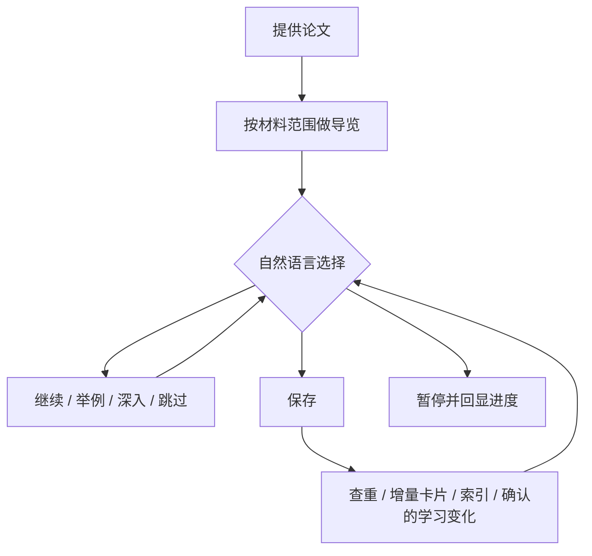

# 设计说明

```mermaid
flowchart TD
  A[提供论文] --> B[按材料范围做导览]
  B --> C{自然语言选择}
  C --> D[继续 / 举例 / 深入 / 跳过]
  D --> C
  C --> E[保存]
  E --> F[查重 / 增量卡片 / 索引 / 确认的学习变化]
  F --> C
  C --> G[暂停并回显进度]
```

入口仅保留共同规则和资源路由。保存、成长、深入阅读分别按需加载。项目配置记录偏好和概念，索引维护论文清单，卡片保存证据及恢复位置，避免重复维护。

能力与阅读数量分开，分类与讲解深度分开，标题显示与原文标识分开。默认先提供价值，只有当前操作缺必要信息时提问。静态规则的验证范围见 [审阅记录](interaction-review.md)。
